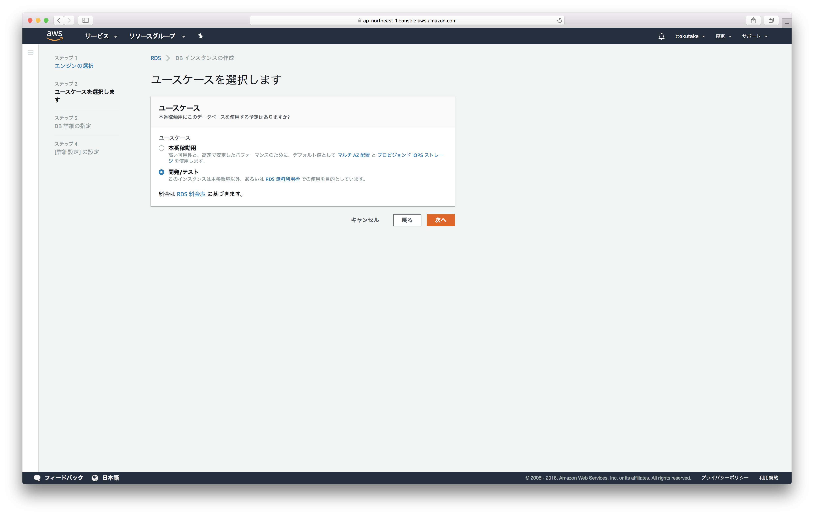
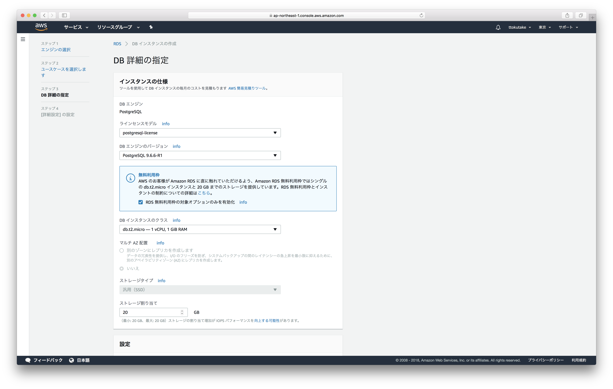
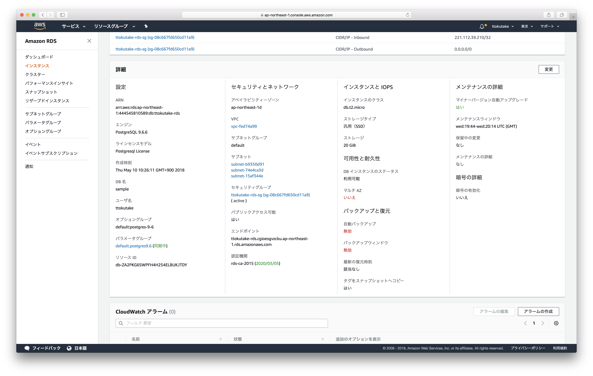

# AWSに触ってみる

IoT事業本部第1開発部4課 徳武

---

## この研修の目的

- サーバーインフラをふんわり理解する
- PaaSやSaaSのありがたみを理解する

---

## AWSって？

- AWS(Amazon Web Services)はAmazonの提供するWebサービスのこと
- IaaS(Infrastructure as a Service)やPaaS(Platform as a Service)、SaaS(Software as a Service)を提供している

>>>

## IaaS？PaaS？SaaS？

- IaaS: Amazon EC2など。ユーザーがサーバーの細かい設定を気にしないといけない
- PaaS: Amazon RDS, Herokuなど。ユーザーは使う上でサーバーの細かい設定を気にしなくて済む
- SaaS: Amazon Rekognition, Gmailなど。ユーザーは使う上でサーバーのリソースとか気にしないで済む

>>>

## IaaSが出現する以前は...

- 自社にサーバーを用意したり
- データセンターのラックを借りたり
- VPSを利用したり


>>>

## IaaSが出現して以降は...

- ボタンポチポチで簡単にサーバーが立てられる！
    - コンピューターリソースの進化
    - コンピューターの仮想化技術の発達


>>>

## いろいろなクラウドベンダー

- AWS
- Microsoft Azure
- GCP(Google Cloud Platform)

---

## 実際に触ってみよう

1. Amazon EC2を触る
2. Amazon RDSを触る
3. クリーンアップ作業
    - 上記作業中に作成したコンポーネントやサービスをメモしておこう
    - (あとで滞りなくクリーンアップするためです)

>>>

## 注意すること

- AWSの利用にはお金がかかります
- 操作にはそれなりに注意を払いましょう

---

## Amazon EC2

- 仮想サーバーを提供するサービス
- とりあえずログインして、サービス一覧からEC2を選べ！
    1. 事前に渡したIAM情報にログインURLがあるのでブラウザで開いてログイン
    2. 右上の「バージニア北部」をクリックして「アジアパシフィック (東京)」を選択
    3. 左上の「サービス」をクリックして検索フォームに「ec2」と入力してenter

>>>

## EC2の仮想サーバーを立ち上げる part1

1. 左メニューの「インスタンス」をクリック
2. 「インスタンスの作成」という青いボタンをクリック
3. 「Amazon Linux 2」を選択して「選択」ボタンをクリック
4. タイプが「t2.micro」となっている行を選択していることを確認
5. 「次の手順:インスタンスの詳細の設定」ボタンをクリック

>>>

## EC2の仮想サーバーを立ち上げる part2

6. 「次の手順:ストレージの追加」ボタンをクリック
7. 「次の手順:タグの追加」ボタンをクリック
8. タグの設定
    - キー: Name
    - 値: (自分のものだとわかりやすい名前)
9. 「次の手順:セキュリティグループの設定」ボタンをクリック

>>>

## EC2の仮想サーバーを立ち上げる part3

10. セキュリティグループ(SG)の設定 part1
    1. 「セキュリティグループ名」に自分のものだとわかりやすい名前を入力
    2. [確認くん](https://www.ugtop.com/spill.shtml)などを使って自分のグローバルIPを確認
    3. タイプ「SSH」のソースを「(グローバルIP)/32」に変更

>>>

## EC2の仮想サーバーを立ち上げる part4

10. セキュリティグループ(SG)の設定 part2
    4. 「ルールの追加」ボタンをクリック
    5. 追加したルールのタイプを「HTTP」に変更
    6. 追加したルールのソースを「(グローバルIP)/32」に変更

>>>

## EC2の仮想サーバーを立ち上げる part5

11. 「確認と作成」ボタンをクリック
12. 「作成」ボタンをクリック
13. キーペアの作成
    1. 「新しいキーペアの作成」を選択
    2. キーペア名に自分のものだとわかりやすい名前を入れて「キーペアのダウンロード」をクリック
    3. 「インスタンスの作成」ボタンをクリック

>>>

## EC2インスタンスにNginxをインストール

1. インスタンス一覧で自分の作成したインスタンスの「IPv4パブリックIP」を確認
2. ターミナルで以下を実施
    ```
    $ chmod 600 ~/Downloads/(キーペア名).pem
    $ ssh ec2-user@(IPv4パブリックIP) -i ~/Downloads/(キーペア名).pem # サーバーにssh
    > sudo yum update
    > amazon-linux-extras                        # nginxのバージョンを確認
    > sudo amazon-linux-extras install nginx1.12 # nginxのインストール
    > sudo systemctl enable nginx
    > sudo systemctl start nginx
    ```
3. ブラウザで`http://(IPv1パブリックIP)`を開く

>>>

## 現状のインフラ構成図

TODO: 図を貼る

>>>

## 現状の構成の問題点

- 冗長性がない: 一台故障したらサービスが停止してしまう
- (他にも色々あるがここでは無視)

>>>

## Load Balancerを導入する Part1

1. 左メニューの「ロードバランサー」をクリック
2. 「ロードバランサーを作成」という青いボタンをクリック
3. 「Application Load Balancer」の「作成」ボタンをクリック
4. 名前に自分のものとわかりやすい名前を入力
5. アベイラビリティーゾーン全てにチェック

>>>

## Load Balancerを導入する Part2

6. タグの設定
    - キー: Name
    - 値: (自分のものだとわかりやすい名前)
7. 「次の手順:セキュリティ設定の構成」ボタンをクリック
8. 「次の手順:セキュリティグループの設定」ボタンをクリック

>>>

## Load Balancerを導入する Part3

9. SGの設定
    1. 「新しいセキュリティグループを作成する」にチェック
    2. セキュリティグループ名に自分のものだとわかりやすい名前を入れる
    3. タイプ「HTTP」のソースを「(グローバルIP)/32」に変更
    4. 「次の手順:ルーティングの設定」ボタンをクリック

>>>

## Load Balancerを導入する Part4

10. ターゲットグループの設定
    1. 名前に自分のものだとわかりやすい名前を入力
    2. ヘルスチェックの詳細設定をクリック
    3. 正常のしきい値を5 => 2に変更
    4. 間隔を30 => 10に変更
    5. 「次の手順:ターゲットの登録」ボタンをクリック

>>>

## Load Balancerを導入する Part5

11. ターゲットの登録
    1. 自分のインスタンスにチェック
    2. 「登録済みに追加」ボタンをクリック
    3. 「次の手順:確認」をクリック
12. 「作成」ボタンをクリック

>>>

## Load Balancerを導入する Part6

13. インスタンス用SGの変更
    1. 左メニューの「セキュリティグループ」をクリック
    2. 自分のインスタンスで使っているセキュリティグループを選択
    3. 「インバウンド」タブの「編集」ボタンをクリック
    4. 「ソース」に自分のALB(Application Load Balancer)用SGのグループIDを入力

>>>

## Load Balancerを導入する Part7

14. 正常に動作しているか確認
    1. 左メニューの「ターゲットグループ」をクリック
    2. 自分の作成したターゲットグループを選択
    3. 「ターゲット」をクリックして、インスタンスのステータスがhealtyになっているか確認

>>>

## Load Balancerを導入する Part8

15. ページの表示を確認
    1. 左メニューの「ロードバランサー」をクリック
    2. 自分の作成したロードバランサーを選択
    3. 「DNS名」をそのままコピーして、ブラウザで開く

>>>

## インスタンスを1台追加する

- TODO: AMIの準備
- TODO: もう一台EC2インスタンスを準備する

>>>

## Auto Scaling Groupを導入する

- TODO: Auto Scaling Groupと起動設定の準備手順を書く
- TODO: Auto Scalingに紐づいていないインスタンスは削除する

>>>

## 現状のインフラ構成図

TODO: 図を貼る

---

## Amazon RDS

マネージドなRDBMS(Relational DataBase Management System)を提供するサービス

>>>

## PostgreSQLをインストール

- Homebrew, GCC, asdfがインストールされていることを確認
    - `brew --version`
    - `gcc --version`
    - `asdf --version`
- PostgreSQLのインストール
    - `asdf plugin-add postgres`
    - `asdf install postgres 9.6.6 && asdf global postgres 9.6.6`
    - (エラーが起こらないことを祈る)

>>>

## RDBって？

- Relational Database (リレーショナルデータベース)
- データ構造が表形式
- 表同士の関係を定義することで複雑なデータの関係性を表現

>>>

## 例えばこんな感じ

- ユーザーテーブル

|id|name|
|-:|:---|
|1 |Taro|
|2 |Jiro|

- コメントテーブル

|id|user.id|comment      |
|-:|------:|:------------|
|A |1      |hello, world!|
|B |2      |hello, RDB!  |

>>>

## RDSの何が嬉しいの？

- いろいろなRDBMSが選べる
- スナップショット
- リードレプリカ
- リソースモニタリング
- その他いろいろ

>>>

## RDS用のSGを作成する

1: EC2の左メニューの"セキュリティグループ"を選ぶ


>>>

## RDS用のSGを作成する

2: "セキュリティグループの作成"をクリック

3: 画像を参考に必要な項目を埋めて"作成"


>>>

## RDSインスタンスを立ち上げる

1: サービス一覧からRDSを選ぶ


>>>

## RDSインスタンスを立ち上げる

2: 左メニューの"インスタンス"を選ぶ

3: "DBインスタンスの起動"をクリック


>>>

## RDSインスタンスを立ち上げる

4: "PostgreSQL"を選んで"次へ"


>>>

## RDSインスタンスを立ち上げる

5: "開発/テスト"を選んで"次へ"



>>>

## RDSインスタンスを立ち上げる

6: "RDS無料利用枠の対象オプションのみを有効化"をチェック



>>>

## RDSインスタンスを立ち上げる

7: 画像を参考に"設定"の各項目を埋めて"次へ"


>>>

## RDSインスタンスを立ち上げる

8: 先ほど作ったRDS用のSGを選択


>>>

## RDSインスタンスを立ち上げる

9: "データベースの名前"は"sample"と入力

10: "バックアップの保存期間"を"0日間"に変更


>>>

## RDSインスタンスを立ち上げる

11: "DBインスタンスの作成"をクリック


>>>

## RDSインスタンスを立ち上げる

12: "DBインスタンスの詳細の表示"をクリック


>>>

## RDSインスタンスを立ち上げる

13: 作成が完了するまで待機


>>>

## RDSインスタンスを立ち上げる

14: ページを下にスクロールして"詳細"を確認 ("エンドポイント"を確認しておこう！)



>>>

## 普段使うときの注意点

- "パブリックアクセシビリティ"は"いいえ"に
- "バックアップ保存期間"は"1日間"以上に

>>>

## PostgreSQLを使ってみる

1: RDSのPostgreSQLに接続してみよう

```bash
$ psql --version
psql (PostgreSQL) 9.6.6

$ psql -h (RDSインスタンスのエンドポイント) -d (データベース名) -U (ユーザー名)
Password for user ttokutake: (ここでパスワードを入力)
psql (9.6.6)
Type "help" for help.

sample=>
```

>>>

## PostgreSQLを使ってみる

2: テーブル作成

```
sample=> create table users (id integer, name text);
CREATE TABLE
```

3: レコード挿入

```
sample=> insert into users values (1, 'Taro');
INSERT 0 1
sample=> insert into users values (2, 'Jiro');
INSERT 0 1
sample=> select * from users;
 id | name
----+------
  1 | Taro
  2 | Jiro
(2 rows)
```

>>>

## スナップショットから復元

1: スナップショットを作成してみよう


>>>

## スナップショットから復元

2: 画像を参考に"スナップショット名"を入力して"スナップショットの取得"


>>>

## スナップショットから復元

3: スナップショット作成の完了を確認


>>>

## スナップショットから復元

4: テーブルを削除してみる

```
sample=> drop table users;
DROP TABLE

sample=> select * from users;
ERROR:  relation "users" does not exist
LINE 1: select * from users;
                      ^

sample=> \q
```

>>>

## スナップショットから復元

5: スナップショットの詳細画面で"スナップショットの復元"をクリック


>>>

## スナップショットから復元

6: "DBインスタンスのクラス"を"db.t2.micro"に

7: "DBインスタンス識別子"に適当な名前を入力


>>>

## スナップショットから復元

8: "DBインスタンスの復元"をクリック
9: 作成完了まで待つ


>>>

## スナップショットから復元

10: 新たなインスタンスの詳細画面で"変更"を選ぶ


>>>

## スナップショットから復元

11: 画像を参考に"セキュリティグループ"で自分のものを選択


>>>

## スナップショットから復元

12: 下にスクロールして"次へ"


>>>

## スナップショットから復元

13: "すぐに適用"を選んで"DBインスタンスの変更"


>>>

## スナップショットから復元

14: 新しいインスタンスの"エンドポイント"を確認しよう

15: 新しいインスタンスに接続してテーブルが復元されてるか確認しよう

>>>

## ここまでやったこと

1. RDSインスタンス(PostgreSQL)を作成してみた
2. PostgreSQLを使ってみた
3. スナップショットからRDSインスタンスを復元してみた

---

## クリーンアップ作業

自分の作ったリソースを削除しよう！

>>>

## なぜクリーンアップが大事か

- 人間はよく忘れる
    - 記憶に残ってるうちに消すのが楽
    - あとからだと消して良いか判断しづらい
- 自分以外の人も使うことを考える
- 余分なものが残っていると...
    - 本当に探したいものが見つけづらくなる
    - あとから見たときに混乱の元になる可能性大

>>>

## クリーンアップしてみる

何かわからないことがあったら聞いてください

---

### 完

お疲れ様でした！
