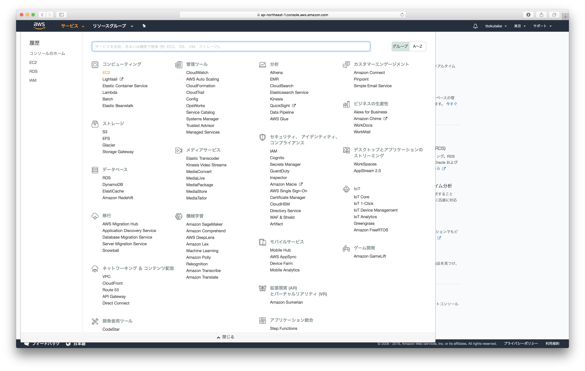
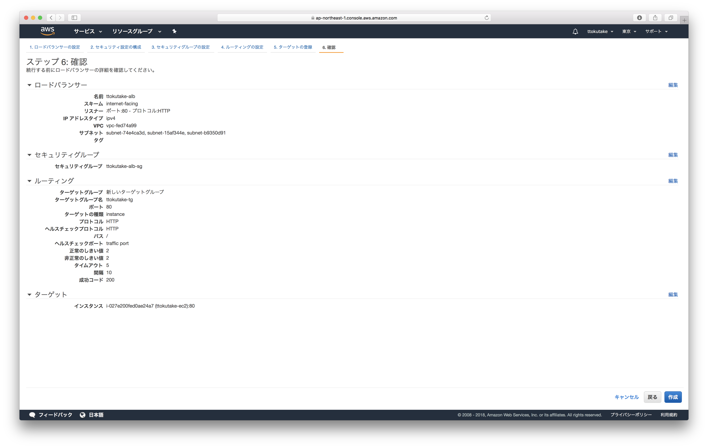

# AWSに触ってみる

IoT事業本部第1開発部4課 徳武

---

## 自己紹介

- 入社5年目の生粋のゆるふわエンジニア
    - どちらかというとサーバーサイドの人間
    - AWSはそれなりに詳しい
    - フロントエンドもできなくはない
- 最近の趣味はNetflix or Amazon Prime Video
    - ブラックミラー
    - アグレッシブ烈子
    - ストレンジャーシングス

---

## この研修の目的

- サーバーインフラをふんわり理解する
- PaaSやSaaSのありがたみを理解する

---

## AWSって？

- AWS(Amazon Web Services)はAmazonの提供するWebサービスのこと
- IaaS(Infrastructure as a Service)やPaaS(Platform as a Service)、SaaS(Software as a Service)を提供している

>>>

## IaaS？PaaS？SaaS？

- IaaS: Amazon EC2など。ユーザーがサーバーの細かい設定を気にしないといけない
- PaaS: AWS Elastic Beanstalk, Herokuなど。ユーザーは使う上でサーバーの細かい設定を気にしなくて済む
- SaaS: Amazon Rekognition, Gmailなど。ユーザーは使う上でサーバーのリソースとか気にしないで済む

>>>

## IaaSが出現する以前は...

- 自社にサーバーを用意したり
- データセンターのラックを借りたり
- VPSを利用したり


>>>

## IaaSが出現して以降は...

- ボタンポチポチで簡単にサーバーが立てられる！
    - コンピューターリソースの進化
    - コンピューターの仮想化技術の発達


>>>

## IaaSのメリット

- 使った時間だけ課金 (従量課金)
- キャパシティープランニングが不要

>>>

## いろいろなクラウドベンダー

- AWS
- Microsoft Azure
- GCP(Google Cloud Platform)

---

## 実際に触ってみよう

1. Amazon EC2を触る
2. Amazon RDSを触る
3. クリーンアップ作業
    - 上記作業中に作成したコンポーネントやサービスをメモしておこう
    - (あとで滞りなくクリーンアップするためです)

>>>

## 注意すること

- AWSの利用にはお金がかかります
- 操作にはそれなりに注意を払いましょう

---

## Amazon EC2

- 仮想サーバーを提供するサービス
- まずはログイン！
    - 事前に渡したIAM情報にログインURLがあるのでブラウザで開いてログイン

>>>

## 仮想サーバーを立ち上げる

1: リージョンを"東京"に変更


>>>

## 仮想サーバーを立ち上げる

2: EC2のトップ画面へ



>>>

## 仮想サーバーを立ち上げる

3: 左メニューの"インスタンス"を選ぶ

4: "インスタンスの作成"をクリック


>>>

## 仮想サーバーを立ち上げる

5: "Amazon Linux 2 LTS ..."を"選択"


>>>

## 仮想サーバーを立ち上げる

6: "次の手順: ..."をクリック


>>>

## 仮想サーバーを立ち上げる

7: "次の手順: ..."をクリック


>>>

## 仮想サーバーを立ち上げる

8: "次の手順: ..."をクリック


>>>

## 仮想サーバーを立ち上げる

9: 画像を参考にタグを追加する

10: "次の手順: ..."をクリック


>>>

## 仮想サーバーを立ち上げる

11: 画像を参考にルールを追加して"確認と作成"をクリック ("ソース"のIPは[自分のグローバルIP](https://www.ugtop.com/spill.shtml))


>>>

## 仮想サーバーを立ち上げる

12: 確認して問題なければ"作成"


>>>

## 仮想サーバーを立ち上げる

13: 画像を参考に"キーペア名"を入力して"キーペアのダウンロード"&"インスタンスの作成"


>>>

## 仮想サーバーを立ち上げる

14: "インスタンスの表示"をクリックして一覧画面へ


>>>

## インスタンスにNginxを導入

1: 作成したインスタンスの"IPv4パブリックIP"を確認


>>>

## インスタンスにNginxを導入

2: ターミナルでいろいろ実施

```bash
$ chmod 600 ~/Downloads/(キーペア名).pem
$ ssh ec2-user@(IPv4パブリックIP) -i ~/Downloads/(キーペア名).pem # サーバーにssh
> sudo yum update
> amazon-linux-extras                        # nginxのバージョンを確認
> sudo amazon-linux-extras install nginx1.12 # nginxのインストール
> sudo systemctl enable nginx
> sudo systemctl start nginx
```

>>>

## インスタンスにNginxを導入

3: ブラウザで`http://(IPv4パブリックIP)`を開く


>>>

## 現状のインフラ構成図


>>>

## 現状の構成の問題点

- 冗長性がない: 一台故障したらサービスが停止してしまう
- (他にも色々あるがここでは無視)

>>>

## Load Balancerを導入する

1: 左メニューの"ロードバランサー"を選ぶ

2: "ロードバランサーを作成"をクリック


>>>

## Load Balancerを導入する

3: "Application Load Balancer"の"作成"をクリック


>>>

## Load Balancerを導入する

4: 画像を参考に"ロードバランサーの設定"

6: "次の手順:..."をクリック


>>>

## Load Balancerを導入する

7: "次の手順:..."をクリック


>>>

## Load Balancerを導入する

8: 画像を参考にSGの設定

9: "次の手順:..."をクリック


>>>

## Load Balancerを導入する

10: 画像を参考に"ルーティングの設定"

11: "次の手順:..."をクリック


>>>

## Load Balancerを導入する

12: 作成済のインスタンスを選んで"登録済みに追加"


>>>

## Load Balancerを導入する

14: "登録済みターゲット"に追加されたことを確認

15: "次の手順:..."をクリック


>>>

## Load Balancerを導入する

16: 確認したら"作成"



>>>

## Load Balancerを導入する

17: "閉じる"


>>>

## Load Balancerを導入する

18: 左メニューの"ターゲットグループ"を選ぶ

19: 自分のTGを選んで"ターゲット"タブを見ると...


>>>

## Load Balancerを導入する

20: 左メニューの"セキュリティグループ"を選ぶ


>>>

## Load Balancerを導入する

21: 左メニューの"セキュリティグループ"を選ぶ

22: EC2用のSGを選んで"インバウンド"の"編集"


>>>

## Load Balancerを導入する

23: "HTTP"の"ソース"をALBのSGに修正する

24: "保存"をクリック


>>>

## Load Balancerを導入する

25: 少し待って"ターゲットグループ"を確認すると...


>>>

## Load Balancerを導入する

25: ALBの"DNS名"を確認したら...


>>>

## Load Balancerを導入する

26: ブラウザで開いてページが表示されることを確認！


>>>

## Load Balancerを導入する

27: インスタンスのIPv4パブリックIPではページが表示されないことも確認してみよう！

>>>

## 現状のインフラ構成図


>>>

## インスタンスを1台追加する

1: 作成したインスタンスをチェックする

2: "アクション"→"イメージ"→"イメージの作成"


>>>

## インスタンスを1台追加する

3: 画像を参考に"イメージ名"などを入力

4: "イメージの作成"をクリック


>>>

## インスタンスを1台追加する

5: "閉じる"


>>>

## インスタンスを1台追加する

6: 左メニューの"AMI"を選び自分のAMIにチェック

7: "アクション"→"作成"


>>>

## インスタンスを1台追加する

8: "次の手順:..."をクリック


>>>

## インスタンスを1台追加する

9: 画像を参考にタグを追加する

10: "次の手順: ..."をクリック


>>>

## インスタンスを1台追加する

11: "次の手順: ..."をクリック


>>>

## インスタンスを1台追加する

12: "次の手順: ..."をクリック


>>>

## インスタンスを1台追加する

13: 画像を参考にSGを選択

14: "次の手順: ..."をクリック


>>>

## インスタンスを1台追加する

15: 確認したら"作成"


>>>

## インスタンスを1台追加する

16: 画像を参考にキーペアを選択

17: 注意にチェックを入れて"インスタンスの作成"


>>>

## インスタンスを1台追加する

18: 自分のTGをチェック

19: "ターゲット"タブを選んで"編集"


>>>

## インスタンスを1台追加する

20: 追加するインスタンスを選び"登録済みに追加"

21: "保存"


>>>

## インスタンスを1台追加する

22: 追加したインスタンスが"healthy"か確認


>>>

## インスタンスを1台追加する

23: 両方のインスタンスに`ssh`して以下を実施

```bash
$ sudo tail -f /var/log/nginx/access.log # SGを設定するときの疎通確認とかにも使える
```

24: ブラウザでNginxのページを表示

25: 何回かリロードして振り分けられることを確認

>>>

## 現状のインフラ構成図

(実はAZが一緒になってしまってるかもしれない?)


>>>

## ここまででやったこと

1. EC2インスタンスを作成してみた
2. Nginxをインストールしてみた
3. ロードバランサーを使った構成にしてみた
4. AMIからインスタンスを作成してみた

ACCESS Connectの裏側が少しは想像できそう？

>>>

## まだまだ便利な機能が

- Auto Scaling
- セキュリティーパッチの自動アップデート
- ...(把握しきるのは難しい)

---

## Amazon RDS

マネージドなRDBMS(Relational DataBase Management System)を提供するサービス

>>>

## PostgreSQLをインストール

- Homebrew, GCC, asdfがインストールされていることを確認
    - `brew --version`
    - `gcc --version`
    - `asdf --version`
- PostgreSQLのインストール
    - `asdf plugin-add postgres`
    - `asdf install postgres 9.6.6 && asdf global postgres 9.6.6`
    - (エラーが起こらないことを祈る)

>>>

## RDBって？

- Relational Database (リレーショナルデータベース)
- データ構造が表形式
- 表同士の関係を定義することで複雑なデータの関係性を表現
- 世の中で一番使われているデータベースの種類

>>>

## 例えばこんな感じ

- ユーザーテーブル

|id|name|
|-:|:---|
|1 |Taro|
|2 |Jiro|

- コメントテーブル

|id|user.id|comment      |
|-:|------:|:------------|
|A |1      |hello, world!|
|B |2      |hello, RDB!  |

>>>

## RDSの何が嬉しいの？

- いろいろなRDBMSが選べる
- 定期バックアップ
- リードレプリカ
- リソースモニタリング
- その他いろいろ

>>>

## RDS用のSGを作成する

1: EC2の左メニューの"セキュリティグループ"を選ぶ


>>>

## RDS用のSGを作成する

2: "セキュリティグループの作成"をクリック

3: 画像を参考に必要な項目を埋めて"作成"


>>>

## RDSインスタンスを立ち上げる

1: サービス一覧からRDSを選ぶ


>>>

## RDSインスタンスを立ち上げる

2: 左メニューの"インスタンス"を選ぶ

3: "DBインスタンスの起動"をクリック


>>>

## RDSインスタンスを立ち上げる

4: "PostgreSQL"を選んで"次へ"


>>>

## RDSインスタンスを立ち上げる

5: "開発/テスト"を選んで"次へ"


>>>

## RDSインスタンスを立ち上げる

6: "RDS無料利用枠の対象オプションのみを有効化"をチェック


>>>

## RDSインスタンスを立ち上げる

7: 画像を参考に"設定"の各項目を埋めて"次へ"


>>>

## RDSインスタンスを立ち上げる

8: 先ほど作ったRDS用のSGを選択


>>>

## RDSインスタンスを立ち上げる

9: "データベースの名前"は"sample"と入力

10: "バックアップの保存期間"を"0日間"に変更


>>>

## RDSインスタンスを立ち上げる

11: "DBインスタンスの作成"をクリック


>>>

## RDSインスタンスを立ち上げる

12: "DBインスタンスの詳細の表示"をクリック


>>>

## RDSインスタンスを立ち上げる

13: 作成が完了するまで待機


>>>

## RDSインスタンスを立ち上げる

14: ページを下にスクロールして"詳細"を確認 ("エンドポイント"を確認しておこう！)


>>>

## 普段使うときの注意点

- "パブリックアクセシビリティ"は"いいえ"に
- "バックアップ保存期間"は"1日間"以上に

>>>

## PostgreSQLを使ってみる

1: RDSのPostgreSQLに接続してみよう

```bash
$ psql --version
psql (PostgreSQL) 9.6.6

$ psql -h (RDSインスタンスのエンドポイント) -d (データベース名) -U (ユーザー名)
Password for user ttokutake: (ここでパスワードを入力)
psql (9.6.6)
Type "help" for help.

sample=>
```

>>>

## PostgreSQLを使ってみる

2: テーブル作成

```
sample=> create table users (id integer, name text);
CREATE TABLE
```

3: レコード挿入

```
sample=> insert into users values (1, 'Taro');
INSERT 0 1
sample=> insert into users values (2, 'Jiro');
INSERT 0 1
sample=> select * from users;
 id | name
----+------
  1 | Taro
  2 | Jiro
(2 rows)
```

>>>

## スナップショットから復元

1: スナップショットを作成してみよう


>>>

## スナップショットから復元

2: 画像を参考に"スナップショット名"を入力して"スナップショットの取得"


>>>

## スナップショットから復元

3: スナップショット作成の完了を確認


>>>

## スナップショットから復元

4: テーブルを削除してみる

```
sample=> drop table users;
DROP TABLE

sample=> select * from users;
ERROR:  relation "users" does not exist
LINE 1: select * from users;
                      ^

sample=> \q
```

>>>

## スナップショットから復元

5: スナップショットの詳細画面で"スナップショットの復元"をクリック


>>>

## スナップショットから復元

6: "DBインスタンスのクラス"を"db.t2.micro"に

7: "DBインスタンス識別子"に適当な名前を入力


>>>

## スナップショットから復元

8: "DBインスタンスの復元"をクリック

9: 作成完了まで待つ


>>>

## スナップショットから復元

10: 新たなインスタンスの詳細画面で"変更"を選ぶ


>>>

## スナップショットから復元

11: 画像を参考に"セキュリティグループ"で自分のものを選択


>>>

## スナップショットから復元

12: 下にスクロールして"次へ"


>>>

## スナップショットから復元

13: "すぐに適用"を選んで"DBインスタンスの変更"


>>>

## スナップショットから復元

14: 新しいインスタンスの"エンドポイント"を確認しよう

15: 新しいインスタンスに接続してテーブルが復元されてるか確認しよう

>>>

## ここまでやったこと

1. RDSインスタンス(PostgreSQL)を作成してみた
2. PostgreSQLを使ってみた
3. スナップショットからRDSインスタンスを復元してみた

---

## 早く終わった人向け

- EC2とRDSを使ったWebアプリケーションの作成
- 言語やWebフレームワークはなんでもOK！

---

## クリーンアップ作業

自分の作ったリソースを削除しよう！

>>>

## なぜクリーンアップが大事か

- 人間はよく忘れる
    - 記憶に残ってるうちに整理するのが楽
    - あとからだと捨てて良いか判断しづらい
- 自分以外の人も使うことを考える
- 余分なものが残っていると...
    - 本当に探したいものが見つけづらくなる
    - あとから見たときに混乱の元になる可能性大
    - アーキテクチャー的なバグを引き起こす可能性あり

>>>

## クリーンアップしてみる

何かわからないことがあったら聞いてください


---

## 今日の内容まとめ

1. ゆるふわにIaaSとは何かを知る
2. ゆるふわにAmazon EC2を触ってみた
3. ゆるふわにAmazon RDSを触ってみた
4. きっちりクリーンアップ！

サーバーインフラのことやPaaS/SaaSのありがたみは理解できたでしょうか？

>>>

## 完

お疲れ様でした！


